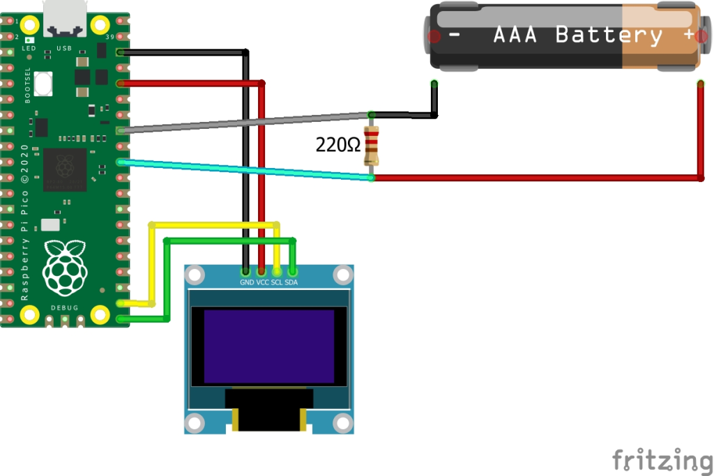

# Battery tester with  Raspberry Pi Pico
This is a simple project for using a Raspberry Pi Pico as a battery tester

## Requirements
- 220Ohm resistor
- OLED Display
- corresponding libraries

## Wiring
As shown in the screenshot (double check ports because this might be different in your setup)

## Have fun
This is just a very basic program to display the voltage of a battery on the screen
